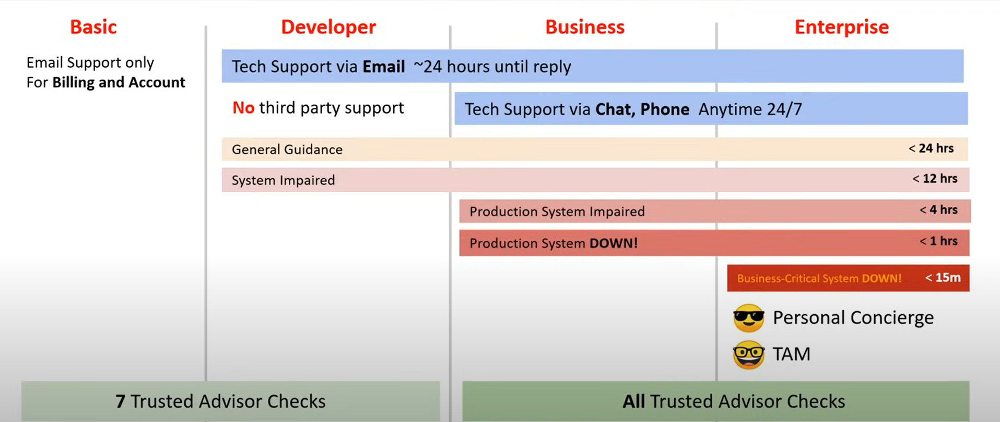
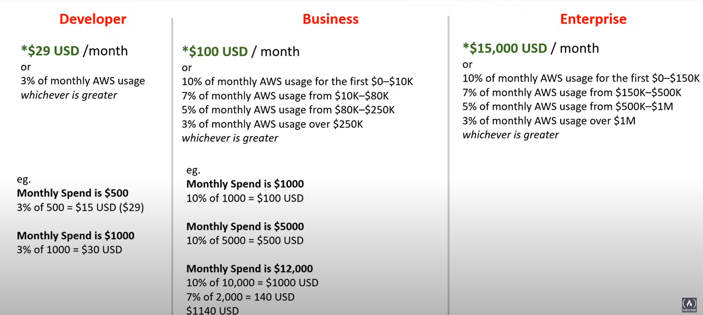

# BILLING, PRICING AND SUPPORT

## AWS FREE SERVICES

AWS Free services are free forever, unlile the "free-tier" that are up toa point of usage or time. But some of them provision other services which may cost money.
 - Identity Access Management (IAM)
 - VPC
 - Auto Scaling
 - CloudFormation
 - Elastic Beanstalk
 - Opsworks
 - Amplify
 - AppSync
 - CodeStar
 - Organization & Consolidated Billing
 - AWS Cost Explorer

## AWS FREE TIER

AWS has a free-tier which allows you to use AWS at no cost:
 - For the first 12 months of signup
 - Or free usage up to a certain monthly limit forever

Some cases are:
 - **EC2 Web Server**: t2.micro 750h per month for 1 year
 - **RDS Database (MySQL or Postgres)**: t2.db.micro 750h per month for 1 year
 - **ELB Load Balancer**: 750h per month for 1 year
 - **Amazon CloudFront Homepage video**: 50GB data-transfer out in total of 1 year

## AWS CREDITS

AWS Promotional Credits are the equivalent to USD dollars on the AWS platform. AWS Credits can be earned several ways:
 - Joining the AWS activate startup program
 - Winning Hackatons
 - Participating in Surveys

AWS Credits generally have an expiry date attached to them.

AWS Credits can be used for most services but there are exceptions where AWS Credits cannot be used (eg: Purchasing a domain via Route 53)

## AWS SUPPORT PLANS

The start payment costs are:
 - **Basic**: 0$/month
 - **Developer**: 29$/month
 - **Business**: 100$/month
 - **Enterprise**: 15000$/month

## TECHNICAL ACCOUNT MANAGER (TAM)

A Techincal Account Manager (TAM) provides both proactive guidance and reactive support to help you succeed with your AWS journey.

TAMs follow the Amazon Leadership Principles Especially about being Customer Obsessed.

TAMs are only available at the Enterprise Support Tier.

## AWS MARKETPLACE

AWS Marketplace is a curated digital catalogue with thousands of software listings from independient software vendors.

Easily find, buy, test and deploy software that already runs on AWS.

The product can be free to use or can have an associated charge. The charge becomes part of your AWS bill and once you pay AWS Marketplace pay the provider.

The sales channel for ISVs and Consulting Partners allows to sell your solutions to other AWS customers.

Products can be offered as:
 - Amazon Machine Image (AMI)
 - AWS CloudFormation templates
 - Software as a Service (SaaS) offerings
 - Web ACL
 - AWS WAF rules

## CONSOLIDATED BILLING

Consolidated Billing is a feature of AWS Organizations that allows you to pay for multiple AWS accounts with one bill.

For billing AWS treats all the account in an organization as if they were one account. Accounts that leave the organization can no longer be part of the same bill.

Consolidated billing is offered at no additional cost.

Use Cost Explorer to visualize usage for Consolidated Billing. You can combine the usage across all the accounts in organization to share the volume pricing discounts.

### Volume Discounts

AWS has Volume Discounts for many services; the more you use, the more you save. 

Consolitated Billing lets you take advantage of Volume Discounts.

Consolidated Billing is a feature of AWS Organizations.

## AWS TRUSTED ADVISOR

AWS Trusted Advisor is a recommendation tool which automatically and actively monitors your AWS account to provide aditional recommendations across a series of categories.

This of AWS Trusted Advisor like an automated checklist of best practices on AWS:

AWS Trusted Advisor has 5 categories:
 - Cost Optimization
 - Perfomance
 - Security
 - Fault tolerance
 - Service limits

AWS Trusted Advisor provides different level of checks based on your AWS Support Plan

Basic and Developer, 7 Trusted Advisor checks:
 - **Security**: 
    - MFA on Root Account
    - Security Groups - Specific ports of unrestricted
    - Amazon S3 Bucket Permissions
    - Amazon EBS Public Snapshots
    - Amazon RDS Public Snapshots
    - IAM Use - Discorage the use of root access
 - **Service Limits**:
    - All Service limits checks are free

Business and Enterprise, All Trusted Advisor checks:
 - **Cost Optimization**: 
    - AWS Account Not Part of AWS Organizations
    - Amazon Comprehend Underutilized Endpoints
    - Amazon EBS over-provisioned volumes
    - Amazon EC2 instances consolidation for Microsoft SQL Server
    - Amazon EC2 instances over-provisioned for Microsoft SQL Server
    - Amazon EC2 Instances Stopped
    - Amazon EC2 Reserved Instance Lease Expiration
    - Amazon EC2 Reserved Instance Optimization
    - Amazon ECR Repository Without Lifecycle Policy Configured
    - Amazon ElastiCache Reserved Node Optimization
    - Amazon OpenSearch Service Reserved Instance Optimization
    - Amazon RDS Idle DB Instances
    - Amazon Redshift Reserved Node Optimization
    - Amazon Relational Database Service (RDS) Reserved Instance Optimization
    - Amazon Route 53 Latency Resource Record Sets
    - Amazon S3 Bucket Lifecycle Policy Configured
    - Amazon S3 Incomplete Multipart Upload Abort Configuration
    - Amazon S3 version-enabled buckets without lifecycle policies configured
    - AWS Lambda Functions with Excessive Timeouts
    - AWS Lambda Functions with High Error Rates
    - AWS Lambda over-provisioned functions for memory size
    - AWS Well-Architected high risk issues for cost optimization
    - Idle Load Balancers
    - Low Utilization Amazon EC2 Instances
    - Savings Plan
    - Unassociated Elastic IP Addresses
    - Underutilized Amazon EBS Volumes
    - Underutilized Amazon Redshift Clusters
 - **Perfomance**:
    - Amazon Aurora DB cluster under-provisioned for read workload
    - Amazon DynamoDB Auto Scaling Not Enabled
    - Amazon EBS Optimization Not Enabled
    - Amazon EBS Provisioned IOPS (SSD) Volume Attachment Configuration
    - Amazon EBS under-provisioned volumes
    - Amazon EC2 Auto Scaling Group is not Associated with a Launch Template
    - Amazon EC2 to EBS Throughput Optimization
    - EC2 Virtualization Type is Paravirtual
    - Amazon ECS Memory Hard Limit
    - Amazon EFS Throughput Mode Optimization
    - Amazon RDS autovacuum parameter is turned off
    - Amazon RDS DB clusters support only up to 64 TiB volume
    - Amazon RDS DB instances in the clusters with heterogeneous instance classes
    - Amazon RDS DB instances in the clusters with heterogeneous instance sizes
    - Amazon RDS DB memory parameters are diverging from default
    - Amazon RDS enable_indexonlyscan parameter is turned off
    - Amazon RDS enable_indexscan parameter is turned off
    - Amazon RDS general_logging parameter is turned on
    - Amazon RDS InnoDB_Change_Buffering parameter using less than optimum value
    - Amazon RDS innodb_open_files parameter is low
    - Amazon RDS innodb_stats_persistent parameter is turned off
    - Amazon RDS instance under-provisioned for system capacity
    - Amazon RDS magnetic volume is in use
    - Amazon RDS parameter groups not using huge pages
    - Amazon RDS query cache parameter is turned on
    - Amazon RDS resources instance class update is required
    - Amazon RDS resources major versions update is required
    - Amazon RDS resources using end of support engine edition under license-included
    - Amazon Route 53 Alias Resource Record Sets
    - AWS Lambda under-provisioned functions for memory size
    - AWS Lambda Functions without Concurrency Limit Configured
    - AWS Well-Architected high risk issues for performance
    - CloudFront Alternate Domain Names
    - CloudFront Content Delivery Optimization
    - CloudFront Header Forwarding and Cache Hit Ratio
    - High Utilization Amazon EC2 Instances
    - Large Number of EC2 Security Group Rules Applied to an Instance
    - Large Number of Rules in an EC2 Security Group
    - Overutilized Amazon EBS Magnetic Volumes
 - **Security**
    - Amazon EC2 instances with Microsoft SQL Server end of support
    - Amazon EC2 instances with Microsoft Windows Server end of support
    - Amazon EC2 instances with Ubuntu LTS end of standard support
    - Amazon CloudWatch Log Group Retention Period
    - Amazon EFS clients not using data-in-transit encryption
    - Amazon EBS Public Snapshots
    - Amazon RDS Aurora storage encryption is turned off
    - Amazon RDS engine minor version upgrade is required
    - Amazon RDS Public Snapshots
    - Amazon RDS Security Group Access Risk
    - Amazon RDS storage encryption is turned off
    - Amazon Route 53 mismatching CNAME records pointing directly to S3 buckets
    - Amazon Route 53 MX Resource Record Sets and Sender Policy Framework
    - Amazon S3 Bucket Permissions
    - Amazon VPC Peering Connections with DNS Resolution Disabled
    - AWS Backup Vault Without Resource-based Policy to Prevent Deletion of Recovery Points
    - AWS CloudTrail Logging
    - AWS Lambda Functions Using Deprecated Runtimes
    - AWS Well-Architected high risk issues for security
    - CloudFront Custom SSL Certificates in the IAM Certificate Store
    - CloudFront SSL Certificate on the Origin Server
    - ELB Listener Security
    - ELB Security Groups
    - Exposed Access Keys
    - IAM Access Key Rotation
    - IAM Password Policy
    - IAM Use
    - MFA on Root Account
    - Security Groups – Specific Ports Unrestricted
    - Security Groups – Unrestricted Access
 - **Fault tolerance**
    - ALB Multi-AZ
    - Amazon Aurora MySQL cluster backtracking not enabled
    - Amazon Aurora DB Instance Accessibility
    - Amazon CloudFront Origin Failover
    - Amazon Comprehend Endpoint Access Risk
    - Amazon DocumentDB Single AZ Clusters
    - Amazon DynamoDB Point-in-time Recovery
    - Amazon DynamoDB Table Not Included in Backup Plan
    - Amazon EBS Not Included in AWS Backup Plan
    - Amazon EBS Snapshots
    - Amazon EC2 Auto Scaling does not have ELB Health Check Enabled
    - Amazon EC2 Auto Scaling Group has Capacity Rebalancing Enabled
    - Amazon EC2 Auto Scaling is not deployed in multiple AZs or does not meet the minimum number of AZs
    - Amazon EC2 Availability Zone Balance
    - Amazon EC2 Detailed Monitoring Not Enabled
    - Amazon ECS AWSLogs driver in blocking mode
    - Amazon ECS service using a single AZ
    - Amazon ECS Multi-AZ placement strategy
    - Amazon EFS No Mount Target Redundancy
    - Amazon EFS not in AWS Backup Plan
    - Amazon ElastiCache Multi-AZ clusters
    - Amazon ElastiCache Redis Clusters Automatic Backup
    - Amazon MemoryDB Multi-AZ clusters
    - Amazon MSK brokers hosting too many partitions
    - Amazon OpenSearch Service domains with less than three data nodes
    - Amazon RDS Backups
    - Amazon RDS DB clusters have one DB instance
    - Amazon RDS DB clusters with all instances in the same Availability Zone
    - Amazon RDS DB clusters with all reader instances in the same Availability Zone
    - Amazon RDS DB Instance Enhanced Monitoring not enabled
    - Amazon RDS DB instances have storage autoscaling turned off
    - Amazon RDS DB instances not using Multi-AZ deployment
    - Amazon RDS DiskQueueDepth
    - Amazon RDS FreeStorageSpace
    - Amazon RDS log_output parameter is set to table
    - Amazon RDS innodb_default_row_format parameter setting is unsafe
    - Amazon RDS innodb_flush_log_at_trx_commit parameter is not 1
    - Amazon RDS max_user_connections parameter is low
    - Amazon RDS Multi-AZ
    - Amazon RDS Not In AWS Backup Plan
    - Amazon RDS Read Replicas are open in writable mode
    - Amazon RDS resource automated backups is turned off
    - Amazon RDS sync_binlog parameter is turned off
    - RDS DB Cluster has no Multi-AZ replication enabled
    - RDS Multi-AZ Standby Instance Not Enabled
    - Amazon RDS ReplicaLag
    - Amazon RDS synchronous_commit parameter is turned off
    - Amazon Redshift cluster automated snapshots
    - Amazon Route 53 Deleted Health Checks
    - Amazon Route 53 Failover Resource Record Sets
    - Amazon Route 53 High TTL Resource Record Sets
    - Amazon Route 53 Name Server Delegations
    - Amazon Route 53 Resolver Endpoint Availability Zone Redundancy
    - Amazon S3 Bucket Logging
    - Amazon S3 Bucket Replication Not Enabled
    - Amazon S3 Bucket Versioning
    - Application, Network, and Gateway Load Balancers Not Spanning Multiple Availability Zones
    - Auto Scaling available IPs in Subnets
    - Auto Scaling Group Health Check
    - Auto Scaling Group Resources
    - AWS CloudHSM clusters running HSM instances in a single AZ
    - AWS Direct Connect Location Resiliency
    - AWS Lambda functions without a dead-letter queue configured
    - AWS Lambda On Failure Event Destinations
    - AWS Lambda VPC-enabled Functions without Multi-AZ Redundancy
    - AWS Resilience Hub Application Component check
    - AWS Resilience Hub policy breached
    - AWS Resilience Hub resilience scores
    - AWS Resilience Hub assessment age
    - AWS Site-to-Site VPN has at least one tunnel in DOWN status
    - AWS Well-Architected high risk issues for reliability
    - Classic Load Balancer has no multiple AZs configured
    - ELB Connection Draining
    - ELB Cross-Zone Load Balancing
    - Load Balancer Optimization
    - NAT Gateway AZ Independence
    - Network Load Balancers Cross Load Balancing
    - NLB - Internet-facing resource in private subnet
    - NLB Multi-AZ
    - Number of AWS Regions in an Incident Manager replication set
    - Single AZ Application Check
    - VPC interface endpoint network interfaces in multiple AZs
    - VPN Tunnel Redundancy
    - ActiveMQ Availability Zone Redundancy
    - RabbitMQ Availability Zone Redundancy
    - ALB Multi-AZ
 - **Service limits**
    - Auto Scaling Groups
    - Auto Scaling Launch Configurations
    - CloudFormation Stacks
    - DynamoDB Read Capacity
    - DynamoDB Write Capacity
    - EBS Active Snapshots
    - EBS Cold HDD (sc1) Volume Storage
    - EBS General Purpose SSD (gp2) Volume Storage
    - EBS General Purpose SSD (gp3) Volume Storage
    - EBS Magnetic (standard) Volume Storage
    - EBS Provisioned IOPS (SSD) Volume Aggregate IOPS
    - EBS Provisioned IOPS SSD (io1) Volume Storage
    - EBS Provisioned IOPS SSD (io2) Volume Storage
    - EBS Throughput Optimized HDD (st1) Volume Storage
    - EC2 On-Demand Instances
    - EC2 Reserved Instance Leases
    - EC2-Classic Elastic IP Addresses
    - EC2-VPC Elastic IP Address
    - ELB Application Load Balancers
    - ELB Classic Load Balancers
    - ELB Network Load Balancers
    - IAM Group
    - IAM Instance Profiles
    - IAM Policies
    - IAM Roles
    - IAM Server Certificates
    - IAM Users
    - Kinesis Shards per Region
    - Lambda Code Storage Usage
    - RDS Cluster Parameter Groups
    - RDS Cluster Roles
    - RDS Clusters
    - RDS DB Instances
    - RDS DB Manual Snapshots
    - RDS DB Parameter Groups
    - RDS DB Security Groups
    - RDS Event Subscriptions
    - RDS Option Groups
    - RDS Read Replicas per Master
    - RDS Reserved Instances
    - RDS Subnet Groups
    - RDS Subnets per Subnet Group
    - RDS Total Storage Quota
    - Route 53 Hosted Zones
    - Route 53 Max Health Checks
    - Route 53 Reusable Delegation Sets
    - Route 53 Traffic Policies
    - Route 53 Traffic Policy Instances
    - SES Daily Sending Quota
    - VPC
    - VPC Internet Gateways
 - **Operational Excellence**
    - Amazon API Gateway Not Logging Execution Logs
    - Amazon API Gateway REST APIs Without X-Ray Tracing Enabled
    - Amazon CloudFront Access Log Configured
    - Amazon CloudWatch Alarm Action is Disabled
    - Amazon EC2 Instance Not Managed by AWS Systems Manager
    - Amazon ECR Repository With Tag Immutability Disabled
    - Amazon ECS clusters with Container Insights disabled
    - Amazon ECS task logging not enabled
    - Amazon OpenSearch Service logging CloudWatch not configured
    - Amazon RDS DB instances in the clusters with heterogeneous parameter groups
    - Amazon RDS Enhanced Monitoring is turned off
    - Amazon RDS Performance Insights is turned off
    - Amazon RDS track_counts parameter is turned off
    - Amazon Redshift cluster audit logging
    - Amazon S3 does not have Event Notifications enabled
    - Amazon SNS Topics Not Logging Message Delivery Status
    - Amazon VPC Without Flow Logs
    - Application Load Balancers and Classic Load Balancers Without Access Logs Enabled
    - AWS CloudFormation Stack Notification
    - AWS CloudTrail data events logging for objects in an S3 bucket
    - AWS CodeBuild Project Logging
    - AWS CodeDeploy Auto Rollback and Monitor Enabled
    - AWS CodeDeploy Lambda is using all-at-once deployment configuration
    - AWS Elastic Beanstalk Enhanced Health Reporting is not Configured
    - AWS Elastic Beanstalk with Managed Platform Updates Disabled
    - AWS Fargate platform version is not latest
    - AWS Systems Manager State Manager Association in Non-compliant Status
    - CloudTrail trails are not configured with Amazon CloudWatch Logs
    - Elastic Load Balancing Deletion Protection Not Enabled for Load Balancers
    - RDS DB Cluster Deletion Protection Check
    - RDS DB Instance Automatic Minor Version Upgrade Check

## SALs

A Service Commitment Agreement (SLA) is a forma commitment about the expected level of service between a customer and a provider. When a service level is not met and if customer meets its obligations under the SLA, customer will be elegible to receive a compensation (eg: financial or service credits).

A Service Level Indicator (SLI) is a metric/measurement that indicates what measure of perfomance a customer is receiving at a given time. A SLI metric could be uptime, perfomance, availality, throughput, latency, error rate, durability, correctness.

A Service Level Object (SLO) is the objective that the provider agreed to meet. SLOs are represented as a specific target percentage over a period time (eg: availability SLA of 99.99% in a period of 3 months).

Target percentajes:
 - 99.95%
 - 99.99%
 - 99.999999999% (commonly called Nine nines)
 - 99.99999999999% (commonly called Nine elevens)

## SERVICE HEALTH DASHBOARD

The Service Health Dashboard shows the general status of AWS services. An icon and details will indicate the status of each AWS service. This is showed in a resume by region.

## PERSONAL HEALTH DASHBOAD

The AWS Personal Health Dashboard provides alerts and guidance for AWS events that might affect your enviroment.

All AWS customers can access the Personal Health Dashboard.

The Personal Health Dashboard shows recent events to help you manage active events and shows proactive notifications so that you can plan scheduled activities.

Use these alerts to get notified about changes that can affect your AWS resources and then following the guidance to diagnose and resolve issues.

## AWS ABUSE

AWS Trust & Safety is a team that specifically deals with abuses ocurring on the AWS platform for the following issues:
 - **Spam**: You are receiving unwanted emails from an AWS-owned IP address or AWS resources are used to spam websites or forums.
 - **Port scanning**: Your logs shows that one more AWS-owned IP addresses are sending packets to multiple ports on your server. You also believe this is an attempt to discover unsecured ports.
 - **Denial-of-service (Dos) attacks**: You logs show that one or more AWS-owned IP addresses are used to flood ports on your resources with packets. You also believe this is an attempt to overwhelm or crash your server or the software running on your server.
 - **Intrusion attempts**: Your logs shows that one or more AWS-owned IP addresses are used to attempt to log in to your resources.
 - **Hosting prohibited content**: You have the evidence that AWS resources are used to host or distribute prohibited content, such as illegal content or copyrighted content without the consent of the copyright holder.
 - **Distributing malware**: You have the evidence that AWS resources are used to distrute software that was knowingly created to compromise or cause harm to computers or machines that it's installed on.

AWS Support does not deal with abuse tickets. You need to contact abuse@amazonaws.com or fill out the Report Amazon AWS Abuse form.

## AWS PARTNER NETWORK (APN)

The AWS Partner Network (APN) is a global partner program for AWS. Joining the APN will open your organization up to business opportunities and allows exclusives trainings and marketing events.

When joining the APN you can either be a:
 - Consulting Partner: You help companies utilize AWS
 - Technology Partner: You build technology ontop of AWS as a service offering

Some aspects are:
 - A partner belongs to a specific tier: Select, Advanced or Premier
 - Different Tiers have different Anual fee commitment
 - Different Tiers have different knowledge requirements
    - AWS Cerfifications
    - AWS APN-Exclusive Cerfications
 - You can get back Promotional AWS Credits
 - You have unique speaking oportunities in the oficial AWS marketing channels (eg: blogs, webinars)
 - Being part of the APN is a requrement to be a Sponsor with a vendor booth at AWS Events

## AWS BUDGETS

AWS Budgets give you the ability to setup alerts if you exceed or are approaching your defined budget.

Create cost, usage or reservation budgets

It can be tracked at the monthly, quarterly or yearly levels with customizable start and ends dates.

Alerts support EC2, RDS, Redshift and ElasticCache reservations.

You can choose your budget amount or be based a different kind or unit. 

First two budgets are free of charge, then each budget is 0.02$ per day (aprox 0.6$ month) with 20000 budgets limit, you can view a list with all your budgets, the history and download as CSV.

AWS Budget can be used to Forecast cost but is limited compared to Cost Explorer or doing you analysis with AWS Cost and Usage Reports along with Business Intelligence tool.

Budget based on a fixed cost or plan your upfront based on your chosen level. Can be easily manage fromm the AWS Budgets dashboard or via Budgets API. You can get notified by providing an email or chatbot and threshold how close to the current or the forecasted budget.

### Budget Reports

AWS Budget Reports is used alongside AWS Budget to create and send daily, weekly or monthly reports to monitor the perfomace of your AWS Budget that will be emailed to specific emails.

AWS Budget Reports serve as more convenient way of staging on top of reports since they are delivered to your email instead of logging into the AWS Management Console.

## COST AND USAGE REPORTS (CRU)

Generate a detailed spreadsheet, enabling you to better analyze and understand your AWS costs, you can choose the granularity of your data by selecting hourly, daily or monthly. CRU data is stored in a CSV (GZIP) or Parquet format in your selected S3 bucket. The report will contain Alocation Tags. 

You can place the reports in S3, use Athena to turn reports into queryable database and use QuickSight to visualize your billing data as graphs.

### Cost allocation tags

Cost allocation tags are optional metadata that can be attached to AWS resouces so when you generate out a Cost and Usage Report you can use thats tags to better analyze your data.

You have to activate the tags you want to show in the report. There are two types:
 - User-defined (eg: Project)
 - AWS generated (eg: aws:createdBy)

## BILLING ALERTS/ALARMS

You can create your own Alarms in CloudWatch Alarms yo monitor spend. They are commonly "Billing Alarms"

You first need to turn on Billing Alarms. Then go create a CloudWatch Alarm and choose Billing as your metric. 

Billing Alarms are much more flexible than AWS Budgets and ideal for more complex use-cases for monitoring spend and usage.

## AWS COST EXPLORER 

AWS Cost Explorer lets you visualize, understand and manage you AWS cost and usage over time. Cost explorer shows in us-east-1.

You can have specific type range and aggregation; contains a robust filtering. It has default reports to help you gain insights into your cost drivers and usage trends or create you own one. Also you can use forecasting to get an idea of future costs.

The data granularity can be monthly or daily. The are filter and grouping functionalities to dig even deeper into your data.

## AWS PRICING API

With AWS you can programmatically access pricing information to get the latest price offering for services

There are two version of this API:
 - Query API: The pricing service API via JSON
 - Batch API: The price list API via HTML

You can also subscribe to Amazon Simple Notification Service (SNS) notifications to get alerts when prices for the services changes.

AWS prices change periodically such as when AWS cuts prices, when new instances types are launched or when services are introduced.